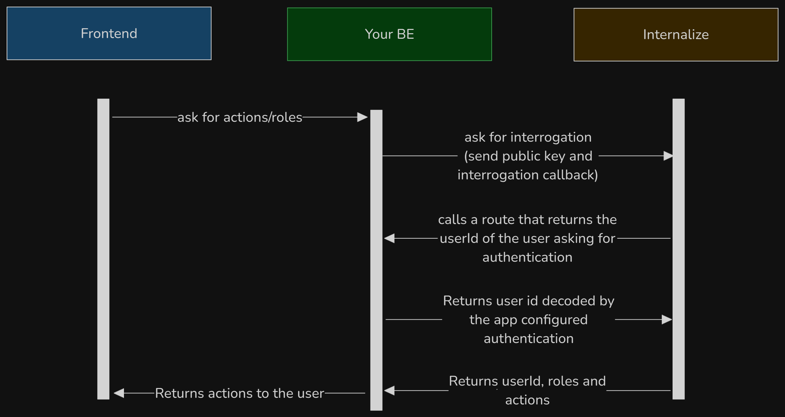

# How to integrate Internalize in your flow
> [!ATTENTION]
> __**Internalize does not provide an authentication to itself!**__ 
> It must be rendered behind a reverse proxy which will handle its authentication.
> Otherwise your internalize instance will be open to the entire world! :smile:

> [!WARNING]
> In this page Authentication Server and BE are the same actor, but the interrogation callback can a third-party service

## Backend Flow
Internalize does not provide any authentication nor authorization out of the box.

This must handled by you following this path:



> [!WARNING]
> Keep in mind loops, if you ask internalize an authorized route which call again internalize you will have a loop. There are no spam protections

1. **Actor asks for actions, or authorization**: an actor (may be your FE, or even the BE) asks for actions or roles to authorize a request, it can be any resource you need to authorize
2. **Your Backend asks Internalize about roles and actions**: in this phase your BE asks for roles to Internalize. Since Internalize does not know what type of authorization are you using, it will need an interrogate callback where the backend request headers will be cloned to. This callback need to return the userId
3. **Internalize find internalized users and their role and actions**: when Internalize has the userId it can retrieve all the roles and actions linked to that userId, and return it to your BE

#### In depth

You will need:
1. A callback on your BE that will return the actual userId (encrypted with Internalize Public Key and encoded to a base64)
2. An RSA public key on your BE that must be sent to Internalize to encode the response

> [!WARNING]
> If you don't want to add more complexity the PUBLIC_KEY header is absolutelly optional, if not used the responses will not be encrypted and managed as clear JSON responses and requests

Then:

#### 1. Compile the internalize url like so:
```http
GET {internalizeBaseUrl}/users/api?interrogate={yourBeCallback}
```
#### 2. Add your `PUBLIC_KEY` in the headers (optional):
```http
GET {internalizeBaseUrl}/users/api?interrogate={yourBeCallback}
PUBLIC_KEY: YOUR_RSA_PUBLIC_KEY
```
#### 3. Add your authorization headers, or cookies:
> [!NOTE]
> Those parameters will be cloned AS-IS from this request, to the interrogation request. So add here all the headers and cookie you will need on your decode interrogation request!

```http
GET https://internalize.be.dev/users/api?interrogate=https://your-be.dev/users/user-id
Authorization: Bearer xyz
```

#### 4. Your BE will receive the interrogation call:
The complete request will be the following:

```http
GET https://your-be.dev/users/user-id
Authorization: Bearer xyz

# Response must be the following
# Which this base64 encoded json, encrypted with the public key of internalize:
#{
#  "userId": "user_id_that_will_match_internalize_user_id",
#  "roles": [
#    "optional_user_roles"
#  ]
#}

ewogICJ1c2VySWQiOiAidXNlcl9pZF90aGF0X3dpbGxfbWF0Y2hfaW50ZXJuYWxpemVfdXNlcl9pZCIsCiAgInJvbGVzIjogWwogICAgIm9wdGlvbmFsX3VzZXJfcm9sZXMiCiAgXQp9

## Or if PUBLIC_KEY is not passed, it will remain as
{
  "userId": "user_id_that_will_match_internalize_user_id",
  "roles": [
    "optional_user_roles"
  ]
}

```

#### 5. Internalize response

Internalize will decrypt and decode your data and will return you a base64 encoded json with the `PUBLIC_KEY` that has been passed to it in the first place so you can keep your private tokens secret:

```http
GET https://internalize.be.dev/users/api?interrogate=https://your-be.dev/users/user-id
Authorization: Bearer xyz

# this will be the callback response
# which is this base64 RSA encrypted json
#{
#  "userId": "user_id_that_will_match_internalize_user_id",
#  "roles": [
#    {
#      "name": "admin",
#      "actions": ["your", "configured", "actions"]
#    }
#  ]
#}

ewogICJ1c2VySWQiOiAidXNlcl9pZF90aGF0X3dpbGxfbWF0Y2hfaW50ZXJuYWxpemVfdXNlcl9pZCIsCiAgInJvbGVzIjogWwogICAgewogICAgICAibmFtZSI6ICJhZG1pbiIsCiAgICAgICJhY3Rpb25zIjogWyJ5b3VyIiwgImNvbmZpZ3VyZWQiLCAiYWN0aW9ucyJdCiAgICB9CiAgXQp9

## Or if PUBLIC_KEY is not passed, it will remain as
{
  "userId": "user_id_that_will_match_internalize_user_id",
  "roles": [
    {
      "name": "admin",
      "actions": ["your", "configured", "actions"]
    }
  ]
}
```

#### 6. Decode and decrypt the internalize response with your private key (optional)
At this point you will have the user id asked, its roles and its actions
```json
{
  "userId": "user_id_that_will_match_internalize_user_id",
  "roles": [
    {
      "name": "admin",
      "actions": ["your", "configured", "actions"]
    }
  ]
}
```

#### Conclusion
Now it's up to you and your configuration to cache the results or change the interrogation callback to create on-scope roles (roles available only on specific resources based on your application logic).

This of course will force your application to remember the user role of a specific path (ie: reporter role on a specific jira ticket, and viewer role in another)

**Internalize will never behave as resource server or role provider** this will be managed by your application and infrastructure